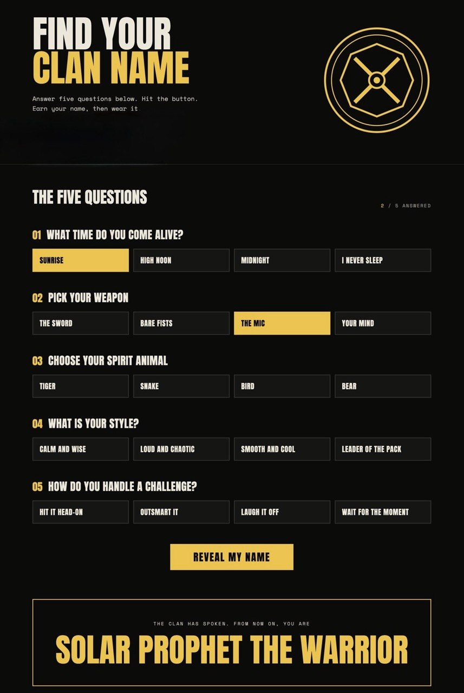

# Wu-Tang Name Generator

A playful web app that creates a custom Wu-Tang-inspired clan name based on five quick personality prompts. 

## Overview

This project asks the user five questions about their style and personality, then combines answer choices to generate a unique name with a Wu-Tang-inspired vibe. 
## Features

- Five-question personality quiz
- Randomized name generation from curated word pools
- Lightweight Node.js server
- Custom clan-themed visual styling

## Tech Stack

- HTML
- CSS
- JavaScript
- Node.js

## Demo



## Getting Started

### Prerequisites

- Node.js installed on your machine

### Installation

1. Clone the repository:
   ```bash
   git clone https://github.com/dagmawitesfay/wu-tang-generator.git
   ```
2. Navigate to the project folder:
   ```bash
   cd wu-tang-generator
   ```
3. Install dependencies:
   ```bash
   npm install
   ```

### Run the app

```bash
npm start
```

Then open your browser to:

```text
http://localhost:8000
```

## How It Works

The app presents questions such as:

- What time do you come alive?
- What is your weapon?
- Which spirit animal matches you?
- What is your style?
- How do you handle a challenge?

Each answer maps to a word bank, and the server randomly selects one word from each category before composing a generated name.

## Project Structure

```text
wu-tang-generator/
├── css/
│   └── style.css
├── image/
│   └── clan-seal.png
├── js/
│   └── main.js
├── index.html
├── package.json
├── server.js
└── README.md
```


